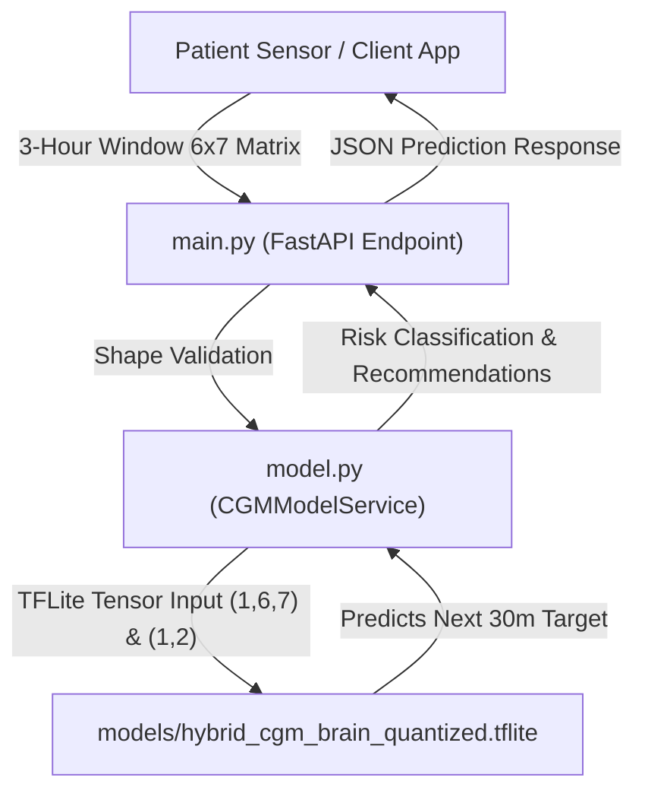

# 🩸 Proactive Glucose Forecasting Model (GRU-1D) - Metabot API

[](https://metabot-aokn.onrender.com/)
[](https://fastapi.tiangolo.com/)
[](https://www.tensorflow.org/lite)
[](https://www.docker.com/)

> **Live Deployment Link**: [https://metabot-aokn.onrender.com/](https://metabot-aokn.onrender.com/)  
> **Live API Documentation (Swagger)**: [https://metabot-aokn.onrender.com/docs](https://metabot-aokn.onrender.com/docs)

---

## 📌 Project Overview

**Metabot** is a proactive glucose forecasting backend powered by a **1D Gated Recurrent Unit (GRU-1D)** deep-learning model. Rather than merely reacting after a dangerous glucose crash (hypoglycemia) or spike (hyperglycemia) has already occurred, Metabot acts as an early-warning system that predicts a patient's exact blood sugar trajectory **30 minutes into the future**.

### The Core Concept
By analyzing recent metabolic and physiological history over a rolling 3-hour window, the system estimates upcoming glycemic trends and calculates clinical danger probabilities. Giving patients and automated insulin delivery (AID) systems a 30-minute head start enables proactive intervention before a medical emergency occurs.

### Key Highlights
- **3-Hour Time Window**: Evaluates 6 rolling time steps sampled at 30-minute intervals ($t-150m, t-120m, t-90m, t-60m, t-30m, t$).
- **Multi-Variable Telemetry**: Tracks Continuous Glucose Monitoring (CGM), Insulin intake (IOB), Carbohydrate consumption (COB), basal rates, time cyclic features, and glucose velocity/pressure.
- **Continuous 30-Minute Target**: Forecasts exact continuous blood sugar (mg/dL) and clinical danger status (`SAFE`, `EVALUATE`, `DANGER`).

---

## 📊 Model Performance & Evaluation

The proactive glucose forecasting system utilizes a two-tier evaluation framework: a **Global Population Baseline** for cold-start safety and a **Patient-Specific Transfer Learning Pipeline** for long-term metabolic adaptation.

---

### Tier 1: Global Population Baseline (Cold-Start Model)
*Evaluated broadly across multiple unseen test patients (31,488 total samples across 5 distinct data chunks) using a binary Safe vs. Danger classification task. This model is currently live in the backend to ensure safe out-of-the-box predictions for new users.*

**Test AUC Score:** `0.7963`

| Class | Precision | Recall | F1-Score | Support |
| :--- | :---: | :---: | :---: | :---: |
| **Safe (75–180 mg/dL)** | 0.88 | 0.92 | 0.90 | 25,196 |
| **DANGER (<75 or >180 mg/dL)** | 0.62 | 0.49 | 0.55 | 6,292 |
| **Overall Accuracy** | | | **0.84** | 31,488 |

* **The Takeaway:** While the global model provides a solid baseline safety net (AUC 0.79), its 49% recall on danger states highlights the limitation of a one-size-fits-all approach—missing roughly half of critical metabolic anomalies due to population variance.

---

### Tier 2: Patient-Specific Transfer Learning (Personalized Model)
*Prototyped and evaluated offline in Kaggle using 2 months of history for veteran patients. By freezing temporal feature extractors and fine-tuning only the decision head with class weights and dynamic threshold calibration, the model adapts cleanly to individual metabolic patterns while separating specific intervention targets.*

**Overall Accuracy:** `0.85`

| Class | Precision | Recall | F1-Score | Support |
| :--- | :---: | :---: | :---: | :---: |
| **Safe (75–180 mg/dL)** | 0.83 | 0.97 | 0.89 | 1,599 |
| **LOW ALERT (<75 mg/dL)** | 0.83 | 0.56 | 0.67 | 126 |
| **HIGH ALERT (>180 mg/dL)** | 0.93 | 0.61 | 0.74 | 707 |
| **Overall Accuracy** | | | **0.85** | 2,432 |

* **The Takeaway:** Transfer learning resolves the population-level blind spots. Low-alert precision jumps to **83%** (drastically reducing false alarms), while the individual catch rates for both hypoglycemia and hyperglycemia increase significantly, proving that personal history is required for precise clinical safety.

---

## 🏗️ System Architecture

Metabot uses a clean 3-file modular Python architecture backed by a quantized TensorFlow Lite inference engine:

```
Metabot/
│
├── main.py                  # 1. FastAPI application, Pydantic schemas, & API endpoints
├── model.py                 # 2. TFLite model singleton loader & prediction logic
├── config.py                # 3. Global constants, sequence parameters, & thresholds
│
├── models/
│   └── hybrid_cgm_brain_quantized.tflite  # Quantized GRU-1D TFLite Model binary
├── Dockerfile               # Production container definition
├── render.yaml              # Render deployment configuration
├── requirements.txt         # Dependencies
└── README.md                # Documentation
```

### Data Pipeline & Prediction Flow



---

## 🛠️ Setup Instructions

### Prerequisites
- **Python**: 3.10 or 3.11 installed
- **Git**: For cloning the repository

### 1. Clone the Repository
```bash
git clone https://github.com/SMH-2518/Metabot.git
cd Metabot
```

### 2. Create and Activate Virtual Environment
```bash
# On Windows
python -m venv venv
venv\Scripts\activate

# On macOS/Linux
python3 -m venv venv
source venv/bin/activate
```

### 3. Install Dependencies
```bash
pip install --upgrade pip
pip install -r requirements.txt
```

---

## 🚀 Steps to Run the Application

### Option A: Run Locally with Uvicorn (Recommended for Development)
```bash
python -m uvicorn main:app --reload --host 127.0.0.1 --port 8000
```
- Open local Swagger UI docs: [http://127.0.0.1:8000/docs](http://127.0.0.1:8000/docs)

### Option B: Run via Docker Container
```bash
# Build the Docker image
docker build -t metabot-cgm .

# Run the Docker container
docker run -p 8000:8000 metabot-cgm
```

---

## 📖 API Documentation & Usage

### Base URLs
- **Live Render Deployment**: `https://metabot-aokn.onrender.com`
- **Local Environment**: `http://127.0.0.1:8000`

---

### Endpoints Summary

| Method | Endpoint | Description |
| :--- | :--- | :--- |
| `GET` | `/` | Root endpoint checking server status and active engine |
| `GET` | `/health` | Detailed health check displaying sequence & model parameters |
| `POST` | `/predict` | Predicts next 30m glucose & danger risk for a 3-hour window |
| `POST` | `/predict/batch` | Processes batch prediction for multiple patient windows |

---

### Sample API Request (`POST /predict`)

#### Request Body (JSON)
```json
{
  "temporal_features": [
    [140.0, 1.2, 0.8, 15.0, 0.500, 0.866, 0.20],
    [142.0, 1.0, 0.8, 10.0, 0.707, 0.707, 0.67],
    [145.0, 0.8, 0.8,  5.0, 0.866, 0.500, 1.00],
    [150.0, 0.6, 0.8,  2.0, 0.966, 0.259, 1.67],
    [158.0, 0.4, 0.8,  0.0, 1.000, 0.000, 2.67],
    [168.0, 0.2, 0.8,  0.0, 0.966,-0.259, 3.33]
  ],
  "static_features": [0.45, 0.62]
}
```

#### Curl Command
```bash
curl -X POST "https://metabot-aokn.onrender.com/predict" \
     -H "Content-Type: application/json" \
     -d '{
       "temporal_features": [
         [140.0, 1.2, 0.8, 15.0, 0.500, 0.866, 0.20],
         [142.0, 1.0, 0.8, 10.0, 0.707, 0.707, 0.67],
         [145.0, 0.8, 0.8,  5.0, 0.866, 0.500, 1.00],
         [150.0, 0.6, 0.8,  2.0, 0.966, 0.259, 1.67],
         [158.0, 0.4, 0.8,  0.0, 1.000, 0.000, 2.67],
         [168.0, 0.2, 0.8,  0.0, 0.966,-0.259, 3.33]
       ],
       "static_features": [0.45, 0.62]
     }'
```

#### Response (JSON)
```json
{
  "danger_probability": 0.7158,
  "predicted_status": "DANGER",
  "predicted_cgm_next_30m": 265.9,
  "routing_recommendation": "CRITICAL RISK: Impending hypo/hyperglycemia within 30 mins. Check glucose & IOB.",
  "inference_engine": "TFLite Model Engine (Quantized)"
}
```
